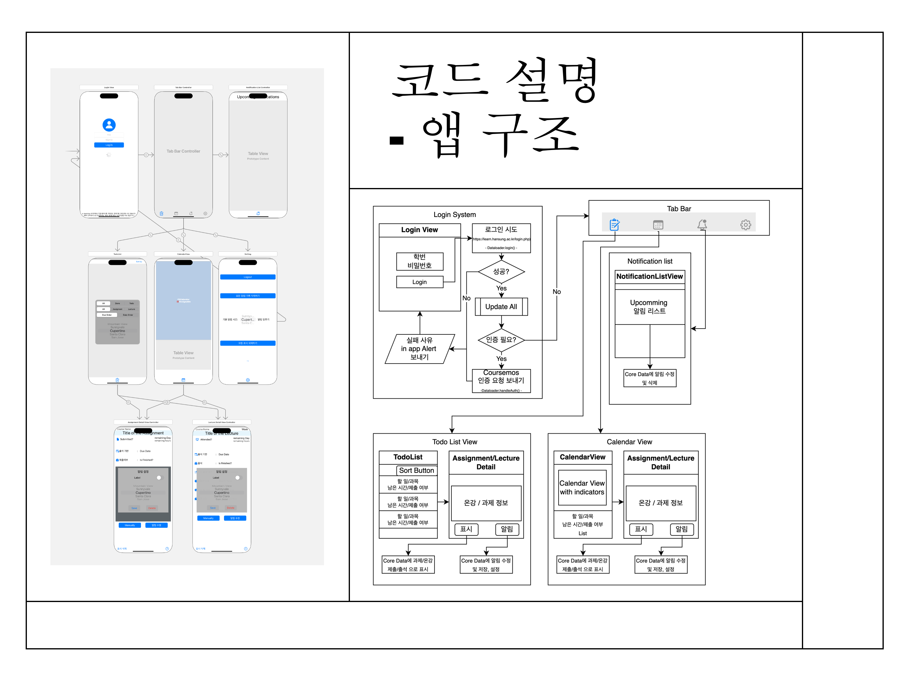

# DotoManager
Ios Application project for HS

2391021 황우솔

### 1.프로젝트 목적

#### 1.1 프로젝트 정의
* e-learning 웹 사이트와 Coursemos에 나오는 모든 온라인 강의 정보와 과제 정보를 한눈에 파악하고 무엇을 언제까지 해야 하는지 알려주고 볼 수 있는 애플리케이션

#### 1.2 프로젝트 구상 배경
* 가끔 까먹게 되는 온라인 강의 및 과제 제출 마감 시간을 알림 기능으로 원하는 시간에 알려주고 사이트나 앱을 통해 과목 하나 하나 들어가 과제와 온라인 강의 내용을 확인하는 불편한 절차를 쉽게 하기 위해 개발하게 됨.

#### 1.3 프로젝트 목표

> 프로젝트 기획 당시 앱의 목표
+ 한눈에 정보를 볼 수 있는 기능
  + 강의/과제/마감기한/과목 등으로 설정하여 리스트 형식, 혹은 달력 뷰로 볼 수 있게 하기
  + 필요할 경우 수동으로 직접 업데이트 할 수 있게 하기
+ 상세히 정보를 볼 수 있는 기능
  + 각 과제에 대해 과제 상세 정보, 마감까지 남은 기간(날짜, 시간). 제출 상태 등을 한번에 확인 할 수 있게 하기
  + 각 온라인 강의에 대해 출석까지 남은 기간(날짜, 시간), 강의의 총 시간, 본 시간, 봐야 하는 시간을 알 수 있게 하기
+ 알림 기능
  + 기본적인 제출하지 않은, 출석하지 않은 할일에 대해 자동으로 알림 설정
  + 기본 알림 시간을 설정할 수 있고 알림에 대해 수동 설정 가능

### 2. 프로젝트 개요

#### 2.1 프로젝트 기능

+ 로그인 기능
  + 기본적인 로그인 시도 기능: 미입력 칸에 대한 Alert, 로그인 실패, 인터넷 오류에 대한 Alert
  + 7일 로그인 안함에 대한 인증 Coursemos 생체 인증 요청 및 인증 필요 Alert
  + 로그아웃 및 모든 정보 삭제 기능

+ 리스트 뷰
  + 리스트 형식의 초록, 빨간색, 노란색으로 한 일, 해야 하는 것(하루 남은 것 ~ 지난 것: 빨강, 지나기 전: 노랑)으로 표시되는 과제/강의
  + 밑으로 리스트를 당겨 reload 할 경우, 실시간 과제/강의 상태로 바로 앱 내 강의/과제가 업데이트 되는 기능
  + 누를 경우 상세 정보를 가진 Assignment View / Lecture View 로 이동
  + 각 Cell: 색상을 통한 현황(제출/출석 완료: 초록, 그 외는 위 참고), 과제/강의 명, 남은 날짜, 과목 명
  + 보여지는 순서 및 과제/강의 설정 가능
    + Control View: All/Done/Todo  -  All/과제/강의  -  Due Order/Date Order  -  All/과목별(각 과목이름)

+ 상세 뷰(Assignment View / Lecture View)
  + Assignment View: 과제명, 과목명, 남은 날짜, 남은 시간, 마감 시간, 제출 여부, 상세 정보(e-learning website), 제출/미제출로 수동 표시하기, 알림 설정, 표시 삭제, 도움말 버튼
  + Lecture View: 강의명, 과목명, 남은 날짜, 남은 시간, 출석 마감 시간, 출석 여부, 주차 출석 여부, 시청 여부, 시청해야 하는 시간, 시청 시간, 출석까지 남은 시청 시간 , 출석/결석으로 수동 표시하기, 알림 설정, 표시 삭제, 도움말 버튼
  + 알림 설정: 알림 끄기/키기, 알림 지우기, 알림 설정 Picker view(마감/출석 마감으로 부터 1시간 단위)
 
+ 출석 및 제출 자동 설정 및 수동 설정 기능
  + 주차 일괄 출석에 대한 자동 출석 표시 가능
  + 시청 안한 영상( - 로 표시되는 강의) 또한 정보 가져오기 가능
  + 결석이지만 시간이 지나서 해야 하는 것(todo, 빨간색) 으로 표시되는 것) 수동 방지 가능한 출석/결석 및 제출/미제출 표시 기능(출석 -> 결석 등 반대로 표시도 가능 및 기본 상태로 되돌리기 가능)
  + 앱 정지 및 재부팅 시에도 정상적인 앱이 다운된 기기 내 저장 가능 기능

+ Calendar View
  + 날짜별 해야 하는 것 및 한 것 표시 기능 (초록색, 빨간색 점을 통한 시각화)
  + 날짜 선택시 리스트 뷰로 뜨는 해당 날 과제/강의와 누르면 뜨는 상세 뷰
  + 다른 달도 쉽게 볼 수 있는 기능
 
+ 알림 기능
  + Upcomming 알림 내용을 모두 확인 할 수 있고 삭제할 수 있는 Notification View
  + 기본적으로 과제 마감 / 출석 마감 3시간 전 알림 설정
  + 설정 창에서 바꾸고 유지시킬 수 있으며 즉시 변경되는 과제/출석 마감 n시간 전 울리기로 변경하기 기능
  + 각 과제/강의 별로 변경 가능한 기능
  + 앱 실행 혹은 정보 업데이트 시 자동으로 해당 과제/강의 상태에 따라 알림이 업데이트 되는 기능(예: 기존 제출 미완료 상태에서 제출 완료로 변경 시, 자동 알림 삭제. 단 수동으로 설정한 알림 설정이 아닌 경우에만)
 
+ 설정
  + 로그아웃, 모든 표시 삭제(초기화), 알림 수동 변경 기능 삭제, 그리고 N시간 전 알림 울리게 하기 선택 가능

#### 2.2 프로젝트 설명 영상
https://youtu.be/Wt24gUAvcDA

#### 2.3 프로젝트 구조
아래는 대략적인 앱 내 구조를 담고 있습니다.

> 대략적인 UI 구조. (전채적인 흐름과 구조만을 담고 있음)

> 로그인 정보, 알림, 표시 저장을 위한 데이터 구조 및 Update 함수의 outline

